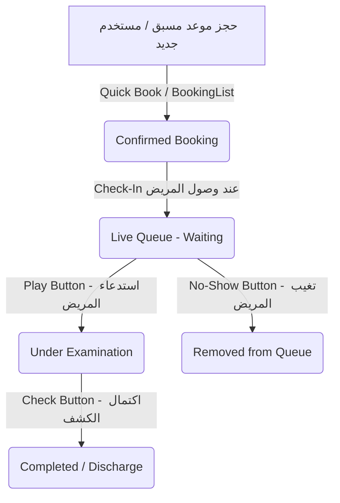

# توثيق مشروع لوحة تحكم موظف الاستقبال للعيادات الطبية (Receptionist Dashboard SaaS)

هذا الملف يشرح بنية وتدفق البيانات والوظائف البرمجية (Functions) المطبقة في لوحة التحكم المصممة لموظفي الاستقبال في العيادات الطبية، مع التركيز على دعم تعدد الفروع والعملاء (Multi-tenant SaaS).

---

## 1. الهيكل العام ودورة حياة البيانات (System Workflow & Data Flow)

يعتمد النظام على **ثلاثة أعمدة رئيسية** في واجهة الاستخدام تُحاكي دورة حضور المريض للعيادة بشكل ديناميكي:

---

## 2. تسلسل استدعاء الدوال وتدفق العمليات (Function Execution Sequence)

عند تفاعل موظف الاستقبال مع النظام، تسير العمليات كالتالي:

### أ. عند تحميل الصفحة لأول مرة (Initialization):
1. تقوم الصفحة باستدعاء الدالة `getLocalState()` لجلب البيانات المخزنة محلياً (المواعيد، قائمة المرضى، الطابور الحالي).
2. يتم بناء رابط الـ API الأساسي (Base URL) ديناميكياً عبر `api.js` عن طريق قراءة نطاق الموقع الحالي `window.location.hostname`.
3. يبدأ كود التزامن اللحظي (Laravel Echo) بالاستماع إلى القناة الخاصة بالفرع المحدد للتحديث المستمر.

### ب. حجز موعد جديد (New Appointment Flow):
1. يضغط الموظف على **"New Appointment Book"** في مكون `QuickActions.jsx` مما يفتح نافذة `Dialog`.
2. يبحث عن المريض عن طريق كتابة الاسم أو الهاتف؛ تقوم الواجهة بتصفية المرضى المسجلين لعرض اقتراحات الإكمال التلقائي.
3. عند ملء البيانات والضغط على "Book"، يتم استدعاء الدالة **`handleBookAppointment`**:
   * إذا كان المريض جديداً، يتم إنتاج مُعرف عشوائي وإضافته لجدول `patients`.
   * يتم إنشاء كائن موعد جديد بالحالة `Confirmed` وإضافته لقائمة المواعيد اليومية `bookings`.
   * يتم تخزين الحالة الجديدة تلقائياً، وتحديث أرقام الإحصائيات (Total Bookings & Remaining).

### ج. تسجيل وصول المريض للعيادة (Check-In Flow):
1. يظهر المريض في العمود الثاني `BookingList.jsx`. عند وصول المريض للعيادة فعلياً، يضغط الموظف على زر **"Check-In"**.
2. يستدعي الزر الدالة **`handleCheckIn`** التي تقوم بـ:
   * تغيير حالة الموعد في جدول `bookings` إلى `Checked-in` (ليختفي من قائمة الانتظار الخارجية).
   * حساب الترتيب التالي للمريض في طابور الانتظار الفعلي للفرع (الرقم الأكبر الحالي + 1).
   * إدراج المريض في جدول طابور الانتظار المباشر `liveQueue` بالحالة `Waiting` وتثبيت وقت الوصول.

### د. إدارة الطابور داخل العيادة (Live Queue Flow):
1. يظهر المريض في العمود الثالث `LiveQueue.jsx` مرقماً برقم تذكرة الانتظار الخاصة به.
2. **استدعاء المريض لغرفة الكشف**: يضغط الموظف على زر التشغيل (Play) لاستدعاء المريض إلى الطبيب، مما يفعل الدالة **`handleStatusChange(id, 'Under Examination')`**:
   * تقوم الدالة تلقائياً بتغيير حالة المريض الحالي إلى `Under Examination` (تحت الفحص) ويتم تمييز بطاقته باللون الأخضر المميز.
   * **شرط الأمان**: تقوم الدالة تلقائياً بتحويل أي مريض آخر في نفس الفرع كان يمر بعملية فحص إلى الحالة `Waiting` لضمان وجود مريض واحد فقط مع الطبيب في نفس الوقت.
3. **انتهاء الكشف**: عند انتهاء الطبيب، يضغط موظف الاستقبال على زر الاكتمال (Check)، مما يفعل الدالة **`handleStatusChange(id, 'Completed')`**:
   * يتم حذف المريض من الطابور المباشر.
   * يتم إعادة ترتيب أرقام طابور المرضى الآخرين تلقائياً لمنع حدوث فجوات في الترقيم.

### هـ. إعادة ترتيب الطابور يدوياً (Queue Reordering Flow):
1. يحتوي كل كارت مريض في قائمة الانتظار المباشر على مقبض سحب (Grip Handle).
2. عند النقر على أسهم الحركة (أو السحب والإفلات مستقبلاً)، يتم تفعيل الدالة **`handleReorderQueue`** التي تقوم بـ:
   * استقبال الطابور بالترتيب الجديد.
   * إعادة ترقيم المرضى تنازلياً وتحديث مصفوفة الانتظار للفرع الحالي فقط مع الحفاظ على الفروع الأخرى دون تغيير.

---

## 3. شرح تفصيلي لكل دالة واستخداماتها (Function Guide)

### 1. `getLocalState()`
* **الموقع**: `src/services/api.js`
* **الاستخدام**: جلب بيانات العيادة (الفروع، المرضى، الحجوزات، طابور الانتظار) من الذاكرة المحلية للمتصفح `localStorage` عند إقلاع التطبيق لأول مرة لضمان استقرار العمليات دون الحاجة لطلب خادم خارجي في النسخة التجريبية.

### 2. `saveLocalState(state)`
* **الموقع**: `src/services/api.js`
* **الاستخدام**: تقوم بحفظ وتخزين الحالة الحالية المحدثة لتطبيق العيادة بالكامل في الذاكرة المحلية للتصفح كلما طرأ أي تغيير على الفروع أو المرضى أو الطابور.

### 3. `handleBookAppointment(newAppt)`
* **الموقع**: `src/pages/ReceptionistDashboard.jsx`
* **المدخلات**: كائن يحتوي على (اسم المريض، الهاتف، نوع الكشف، وقت الحجز، ومعرف المريض إن وجد).
* **الاستخدام**: تسجيل حجز جديد في قاعدة البيانات (أو محاكاة ذلك)، وتسجيل المريض تلقائياً في قائمة المرضى الدائمة للعيادة في حال كان يزور العيادة لأول مرة.

### 4. `handleCheckIn(bookingId)`
* **الموقع**: `src/pages/ReceptionistDashboard.jsx`
* **المدخلات**: معرف الحجز الفريد (`bookingId`).
* **الاستخدام**: تحويل المريض من قائمة الحجوزات المسبقة البعيدة إلى الحضور الفعلي داخل غرفة الانتظار مع تخصيص رقم مسلسل له في الطابور وحساب وقت وصوله بدقة.

### 5. `handleStatusChange(queueId, newStatus)`
* **الموقع**: `src/pages/ReceptionistDashboard.jsx`
* **المدخلات**: معرف الانتظار (`queueId`)، الحالة المستهدفة (`newStatus` مثل: `Under Examination` أو `Completed` أو `No-Show`).
* **الاستخدام**: التحكم في تنقلات المريض داخل العيادة. تضمن هذه الدالة ضبط منطق العمل (Business Rules) مثل عدم وجود أكثر من مريض واحد قيد الفحص لدى الطبيب، وإعادة ترقيم باقي الطابور عند خروج مريض منه.

### 6. `handleReorderQueue(updatedBranchQueue)`
* **الموقع**: `src/pages/ReceptionistDashboard.jsx`
* **المدخلات**: مصفوفة الانتظار الخاصة بالفرع بعد تعديل ترتيبها.
* **الاستخدام**: تطبيق الترتيب اليدوي الجديد الذي يقوم به موظف الاستقبال على طابور الانتظار للفرع الحالي، وتجهيزه ليتم إرساله عبر بروتوكول Websockets (Laravel Echo) لباقي الشاشات كشاشة الطبيب أو شاشات التلفاز المعلقة بصالة الانتظار.

### 7. بناء رابط الاتصال الديناميكي (`api.js`)
* **الموقع**: `src/services/api.js`
* **الاستخدام**: يقوم بالتحقق من الـ Subdomain الحالي للمتصفح. فمثلاً لو كان الرابط هو `maadi.my-saas.test:3000` يستخرج `maadi.my-saas.test` ويقوم بتحويل روابط الطلبات البرمجية تلقائياً للخادم الخاص بهذا المستأجر (Tenant) على المنفذ المخصص `http://maadi.my-saas.test:8000/api/v1` مما يجعل التطبيق جاهزاً تماماً للإنتاج (Production-ready).
